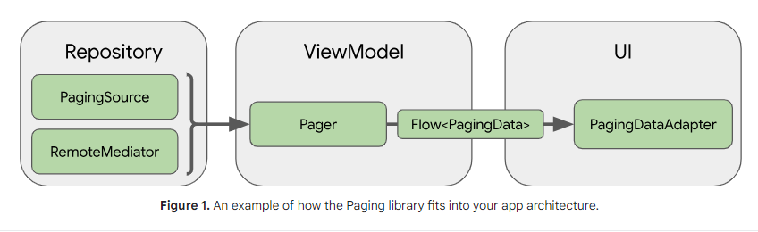

# Tổng quan về Paging library

- Paging library giúp bạn tải và hiển thị các trang dữ liệu từ larger dataset lấy từ local storage
  hoặc network. Cách tiếp cận này cho phép ứng dụng của bạn sử dụng cả băng thông mạng và tài nguyên
  hệ thống hiệu quả hơn. Các thành phần của thư viện Paging được thiết kế để phù hợp với
  [Android app architeture](https://developer.android.com/topic/architecture) được đề xuất, tích hợp
  hoàn hảo với các thành phần Jetpack khác và cung cấp khả năng hỗ trợ Kotlin hạng nhất
  (first-class).

## Lợi ích của việc sử dụng Paging library

Paging library bao gồm các tính năng sau:

- lưu trong bộ nhớ đêm cho dữ liệu phân trang của bạn. Điều này giúp đảm bảo rằng ứng dụng của bạn
  sử dụng tài nguyên hệ thống một cách hiệu quả khi làm việc với dữ liệu được phân trang.
- Tính năng chống trùng lặp yêu cầu được tích hợp sẵn, giúp đảm bảo rằng ứng dụng của bạn sử dụng
  băng thông mạng và tài nguyên hệ thống một cách hiệu quả.
- Configurable RecyclerView adapter có thể định cấu hình tự động yêu cầu dữ liệu khi người dùng cuộn
  về cuối dữ liệu đã tải
- First-class support cho các coroutine và flows Kotlin cũng như LiveData và RxJava.
- Hỗ trợ tích hợp để xử lý lỗi, bao gồm khả năng làm mới (refresh) và thử lại (retry capabilities).

## Setup

Để import paging component vào ứng dụng Android, hãy thêm các phần phụ thuộc sau vào tệp
build.gradle của ứng dụng:

```
dependencies {
val paging_version = "3.2.1"

implementation("androidx.paging:paging-runtime:$paging_version")

// alternatively - without Android dependencies for tests
testImplementation("androidx.paging:paging-common:$paging_version")

// optional - RxJava2 support
implementation("androidx.paging:paging-rxjava2:$paging_version")

// optional - RxJava3 support
implementation("androidx.paging:paging-rxjava3:$paging_version")

// optional - Guava ListenableFuture support
implementation("androidx.paging:paging-guava:$paging_version")

// optional - Jetpack Compose integration
implementation("androidx.paging:paging-compose:3.3.0-alpha02")
}
```

## Library architecture

Các thành phần của thư viện Paging hoạt động trong ba tầng ứng dụng của bạn:

- The repository layer
- The ViewModel layer
- The UI layer
  